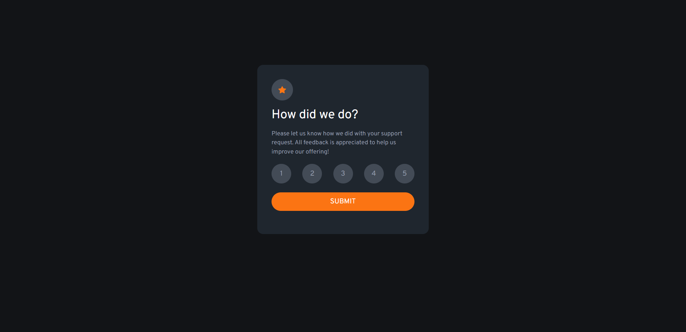
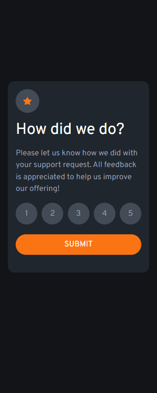

# Frontend Mentor - Social proof section solution

This is a solution to the [ Interactive rating component.](https://www.frontendmentor.io/challenges/interactive-rating-component-koxpeBUmI). Frontend Mentor challenges help you improve your coding skills by building realistic projects.

## Table of contents

- [Overview](#overview)
  - [The challenge](#the-challenge)
  - [Screenshot](#screenshot)
  - [Links](#links)
- [My process](#my-process)
  - [Built with](#built-with)
  - [Continued development](#continued-development)
- [Author](#author)

## Overview

### The challenge

Users should be able to:

- View the optimal layout for the section depending on their device's screen size.

### Screenshot

|  |  |
| ------------------------------ | ----------------------------- |
| Desktop version                | Mobile version                |

### Links

- Solution URL: [Code on GitHub](https://github.com/malek-bt/Interactive-rating-component)
- Live Site URL: [GitHub Pages Live URL]()

## My process

Worked on displaying the layout as given in the design.
Added media queries for smaller devices to show optimal layout to the user.

### Built with

- Semantic HTML5 markup
- CSS custom properties
- Flexbox
- Bootstrap 5
- Grid
- JS

### Continued development

Will do more of these challenges to improve my skills.

## Author

- Frontend Mentor - [@malekbentaher](https://www.frontendmentor.io/profile/malek-bt)
- Linkedin - [@malek-bentaher-361028222](https://www.linkedin.com/in/malek-bentaher-361028222/)
